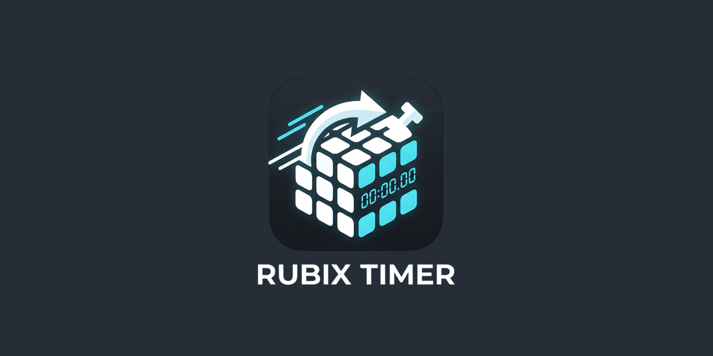

<p align="center">
  
</p>

<h1 align="center">Rubix Timer</h1>

<p align="center">
  <strong>The Professional AI-Powered Speedcubing Timer with Immersive HUD Experience.</strong>
</p>

<p align="center">
  
  
  
  
</p>

---

## ✨ Features

- 🖐️ **AI Hand Tracking**: Powered by MediaPipe Hands for professional Stackmat-style interaction.
- ⚡ **Instant Response**: Optimized "Density-based" detection for millisecond-precision starts and stops.
- 📺 **Immersive HUD UI**: Full-screen camera background with elegant Glassmorphism floating overlays.
- 🎭 **Dynamic Animations**: Smooth scale-and-center transitions when the timer is running to maximize focus.
- 📊 **Solve History & Stats**: Track your PB, Ao5, and Ao12 in real-time with an elegant sidebar history.
- 📱 **Responsive Design**: Works on both desktop and mobile (Landscape orientation recommended).

---

## 🚀 Quick Start

### 1. Installation
Clone the project and install dependencies:
```bash
git clone https://github.com/nonbangkok/Rubix.git
cd Rubix
npm install
```

### 2. Run Locally
```bash
npm run dev
```
Open [http://localhost:3000](http://localhost:3000) and grant camera permissions.

---

## 🛠 Tech Stack

- **Framework**: [Next.js 14+](https://nextjs.org/) (App Router)
- **Vision Engine**: [MediaPipe Hands](https://developers.google.com/mediapipe/solutions/vision/hand_landmarker) (Running in Web Workers)
- **State Management**: [Zustand](https://github.com/pmndrs/zustand)
- **Styling**: Vanilla CSS Modules (Glassmorphism & Neon Glow)
- **Language**: TypeScript (Strict Mode)

---

## 📖 How to Use

1. **Setup**: Place your camera so your hands are visible on the bottom part of the screen.
2. **Arming**: Place both hands on the virtual "Red Pads" shown in the camera feed.
3. **Ready**: Wait for the pads/timer to turn **Green**.
4. **Solve**: Lift your hands to start the timer.
5. **Stop**: Place both hands back on the pads immediately after solving to stop the clock.
6. **Reset**: Lift your hands again to return to IDLE state.

---

## 🤝 Contributing

Contributions are welcome! Please check our [CONTRIBUTING.md](CONTRIBUTING.md) for guidelines on how to get started.

---

## 📄 License

This project is licensed under the MIT License - see the [LICENSE](LICENSE) file for details.

---

<p align="center">Made with ❤️ for the Speedcubing Lover</p>
